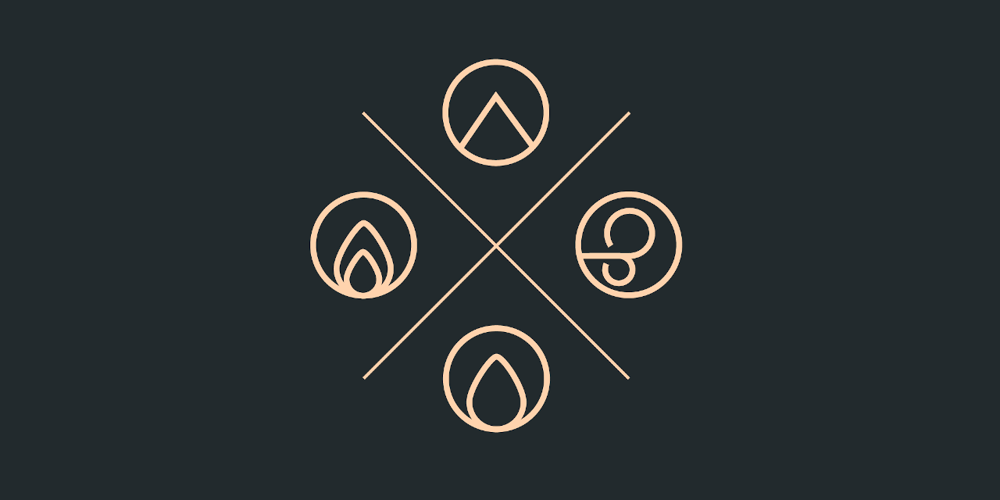

# Fabricate
{: .no_toc }

  

    Table of contents
  

  {: .text-delta }
- TOC
{:toc}

## About

Fabricate is a system-agnostic, flexible crafting module for FoundryVTT.
Fabricate is currently maintained by [MisterPotts].

Use the left navigation, as well as the search at the top of this page, to learn how to build your own crafting systems using Fabricate.
Read on below to find out more about this module and how to support its development. 

## Embedded crafting systems

The following crafting systems come pre-installed with Fabricate.
You can use them as an example. include them in your games, or disable them in the crafting system settings. 

| Crafting system name                                                                                                                | Supported game system(s) | Author                                                         | Description                                                                                                                                                                                                                                                                |
|-------------------------------------------------------------------------------------------------------------------------------------|--------------------------|----------------------------------------------------------------|----------------------------------------------------------------------------------------------------------------------------------------------------------------------------------------------------------------------------------------------------------------------------|
| [Alchemist's Supplies V1.6](https://drive.google.com/file/d/0Bw5jGdLGg-l5ell6MnJyTlRqZms/view?resourcekey=0-_0w_-W6AugWndWk4AdDMwQ) | D&D 5th Edition          | [/u/calculuschild](https://www.reddit.com/user/calculuschild/) | Alchemy is the skill of exploiting unique properties of certain plants, minerals, and creature parts, combining them to produce fantastic substances. This allows even non-spellcasters to mimic minor magical effects, although the creations themselves are non-magical. |

## Frequently Asked Questions (FAQ)

{: .note-title }
> Question
>
> Can I use items from compendiums in Fabricate, including locked ones, like the 5th Edition SRD Item compendium?

Yes. 
Just treat them like any other item when adding them to crafting systems in Fabricate.

{: .note-title }
> Question
>
> Why don't I see Fabricate in the official list of modules?

Because it's not finished, and therefore not released yet.

{: .note-title }
> Question
>
> When will Fabricate be released?

When it's done. 
I want to finish core crafting and alchemy before then, as well as having some time to test it with a smaller audience.

{: .note-title }
> Question
> 
> Will Fabricate be free?

Yes, but don't let that stop you [supporting me on Patreon](#sponsor-this-project) if you appreciate what I'm doing.

{: .note-title }
> Question
>
> How can I contribute?

If you'd like to be involved I'd love to have some help! 
Take a look at the [contributing guide](https://github.com/misterpotts/fabricate/blob/main/CONTRIBUTING.md) and feel free to get in touch va [Discord](https://github.com/misterpotts/fabricate/blob/main/discordapp.com/users/MisterPotts#0255) or [email](mailto:matt@mrpotts.uk). 
I'm always happy to talk about how people can contribute.

## Sponsor this project

[MisterPotts] builds Fabricate alone, in his spare time, for free.

If you like Fabricate and want to show some support, you can do so on [Patreon] for access to:

- A library of over 500 RPG crafting icons
- Early access to Fabricate releases
- A small amount of 5E content
- The ✨ good feels ✨ that come from supporting an open source module author 
- Access to Patron Discord channels and the ability to vote on new features 

----

[MisterPotts]: https://github.com/misterpotts
[Patreon]: https://patreon.com/misterpotts